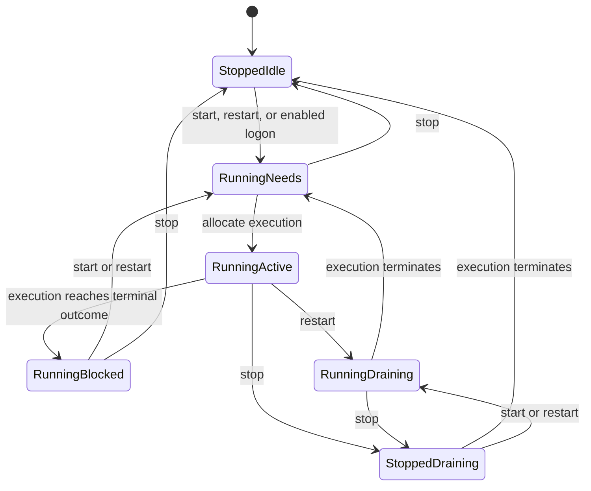
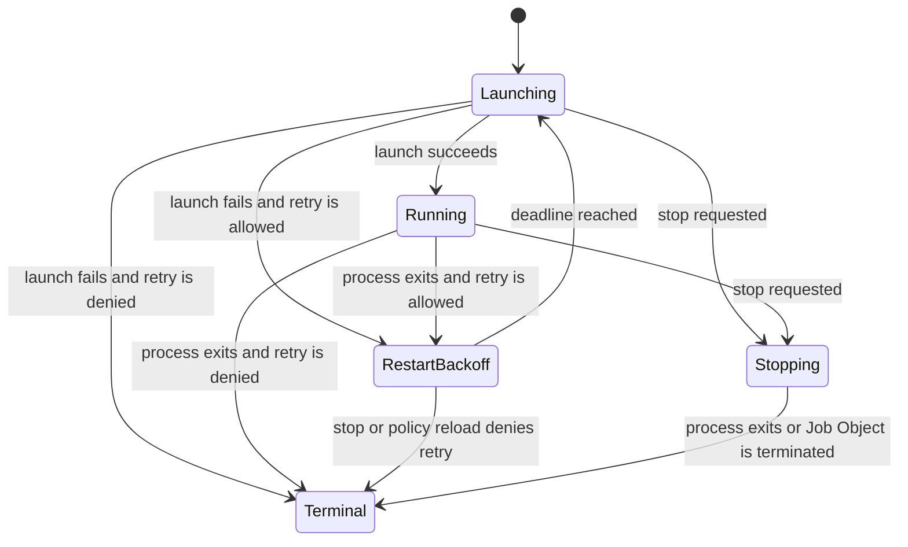

# State machines

This document defines the v1 lifecycle model. It is authoritative for controller and supervisor behavior; CLI status values are projections of these states rather than additional sources of truth.

## Invariants

1. A manager session begins at user logon and ends at the matching logoff. Controller restarts within it keep the same manager-session identity.
2. A workload has at most one active execution.
3. Attempts inside one execution are strictly sequential and numbered from one. An attempt begins before executable resolution and `CreateProcess`, so a preflight or process-creation failure consumes an attempt and participates in restart policy.
4. One execution uses one immutable process-creation configuration snapshot. Automatic retries use that snapshot even when a newer definition requires restart.
5. Enablement is independent of service desired state and job activity.
6. Only the controller writes SQLite. A supervisor writes only its own append-only runtime journal and workload journal segments.
7. The controller persists an accepted lifecycle mutation before performing its external side effects. Cancelling the initiating RPC does not cancel an accepted mutation.
8. Generated Protobuf types and Tonic status codes do not enter the lifecycle model. Protocol handlers convert them into typed commands and outcomes.
9. An active execution has one durable supervisor identity and at most one authenticated process incarnation. A replacement process increments the incarnation only after the previous process is known dead; observation sequence and runtime-journal ownership stay with the durable identity.

Identifiers such as `ManagerSessionId`, `WorkloadId`, `IntentRevision`, `ExecutionId`, `SupervisorId`, `SupervisorIncarnation`, and `AttemptNumber` are distinct types even when their stored representations are strings or integers.

### Manager-session identity

The host issues a random `ManagerSessionId` when it first observes an eligible `SID + TOKEN_STATISTICS.AuthenticationId` logon pair. It stores the mapping below a host-owned volatile `HKEY_LOCAL_MACHINE` registry key and removes it at logoff. The volatile mapping survives host and controller process restarts but is not durable machine state across a full shutdown.

The controller stores the issued UUID with manager-session-scoped desired state. It never uses the Windows LUID directly as the persistent identity because Windows guarantees LUID uniqueness only until system restart. The UUID is a correlation identifier, not a credential; the host still authenticates the user token and SID whenever it launches or reconnects a controller.

## Controller authority

The controller owns definitions, enablement, service intent, job activity, execution history, and supervisor orchestration. It serializes commands and observed supervisor events per workload.

### Service control

Service control is manager-session scoped. With an available definition, a new manager session initializes an enabled service as `Running.NeedsExecution` and a disabled service as `Stopped.Idle`; it never restores manual desired state from an earlier manager session. Missing enabled definitions remain pending until a successful reload restores them.

```rust
enum ServiceControl {
    Stopped(StoppedPhase),
    Running {
        revision: IntentRevision,
        phase: RunningPhase,
    },
}

enum StoppedPhase {
    Idle,
    Draining { execution_id: ExecutionId },
}

enum RunningPhase {
    NeedsExecution,
    Active { execution_id: ExecutionId },
    Draining { execution_id: ExecutionId },
    Blocked {
        execution_id: ExecutionId,
        outcome: ExecutionOutcome,
    },
}
```

`Blocked` means the service is still desired running, but its execution reached a terminal outcome after restart policy declined another attempt. Reconciliation must not create a new execution for the same intent revision. A new `start` or `restart` increments the revision and clears the block.



| Current control state | Command or event | Durable transition | Side effect |
| --- | --- | --- | --- |
| `Stopped.Idle` | `start` or `restart` | `Running(new revision, NeedsExecution)` | Reconciliation allocates an execution. |
| `Stopped.Draining` | `start` or `restart` | `Running(new revision, Draining)` | Let the old execution finish, then allocate one replacement. |
| `Running.NeedsExecution` | `start` | No change | None; the command is idempotent. |
| `Running.Active` | `start` | No change | None; the command is idempotent. |
| `Running.Draining` | `start` | No change | None; the existing replacement intent is already recorded. |
| `Running.Blocked` | `start` | `Running(new revision, NeedsExecution)` | Allocate a manual retry as a new execution. |
| Any `Running` state | `restart` | Increment revision; active execution becomes `Draining`, otherwise `NeedsExecution` | Stop the old execution with cause `restart`, then allocate exactly one replacement. |
| `Running.Active` or `Running.Draining` | `stop` | `Stopped.Draining` | Stop the active execution and cancel any pending replacement. |
| `Running.NeedsExecution` or `Running.Blocked` | `stop` | `Stopped.Idle` | Cancel pending allocation; do not start a process. |
| `Stopped` | `stop` | No change | None; stop is idempotent. |
| `Running.Active` | terminal execution | `Running.Blocked` | None. A new execution requires a new intent revision. |
| `Running.Draining` | terminal execution | `Running.NeedsExecution` | Allocate the replacement. |
| `Stopped.Draining` | terminal execution | `Stopped.Idle` | None. |

Repeated `restart` commands while an execution is draining coalesce into one replacement. The latest intent revision is persisted, but intermediate revisions never create executions.

### Job control

Jobs have no desired state. Their activity and enablement are separate records.

```rust
enum JobActivity {
    Idle,
    Active {
        execution_id: ExecutionId,
        after: AfterActive,
    },
}

enum AfterActive {
    Nothing,
    Rerun,
}

struct JobEnablement {
    state: Enablement,
    last_trigger: SessionTrigger,
}

enum SessionTrigger {
    Never,
    Triggered(ManagerSessionId),
}
```

| Current activity | Command or event | Durable transition | Side effect |
| --- | --- | --- | --- |
| `Idle` | `run` or `rerun` | `Active(new execution, Nothing)` | Start the execution. |
| `Active` | `run` | No change | Return `already_running`. |
| `Active(_, Nothing)` | `rerun` | `Active(same execution, Rerun)` | Cancel the active execution. |
| `Active(_, Rerun)` | `rerun` | No change | None; repeated reruns coalesce. |
| `Active` | `cancel` | Clear `Rerun`, keep the current execution active until terminal | Cancel the active execution. |
| `Idle` | `cancel` | No change | None; cancel is idempotent. |
| `Active(_, Nothing)` | terminal execution | `Idle` | None. |
| `Active(_, Rerun)` | terminal execution | `Active(new execution, Nothing)` | Start one replacement if the definition still exists; otherwise become `Idle` and report `definition_missing`. |

At manager-session start, the controller creates one execution for each enabled job whose `last_triggered_session` differs from the current manager session. It writes the new execution and `last_triggered_session` in the same SQLite transaction. A controller crash after that transaction resumes the recorded execution instead of creating another. Enablement remains set for later manager sessions.

If an enabled workload has no definition at logon, reconciliation leaves its trigger pending. Restoring the definition with a successful reload during the same manager session starts the enabled service or creates the enabled job execution. A job's `last_triggered_session` advances only in the transaction that creates that execution.

The controller completes enabled-start reconciliation before accepting CLI lifecycle commands. A manual execution therefore cannot race the automatic per-logon execution during startup.

Enabling or disabling a workload never starts, stops, runs, or cancels it in the current manager session. Disabling a missing workload is allowed; enabling one requires a current definition.

### Supervisor binding

The controller tracks the process that implements an active execution separately from the execution phase. Launching `susm-supervisor` is infrastructure work, not a workload attempt, so its failures never consume `restart.max_restarts`.

```rust
struct SupervisorProcessIdentity {
    supervisor_id: SupervisorId,
    incarnation: SupervisorIncarnation,
}

enum SupervisorBinding {
    Discovering {
        process: SupervisorProcessIdentity,
        failures: SupervisorFailureCount,
        deadline: DiscoveryDeadline,
    },
    LaunchPending {
        process: SupervisorProcessIdentity,
        failures: SupervisorFailureCount,
    },
    AwaitingHandshake {
        process: SupervisorProcessIdentity,
        failures: SupervisorFailureCount,
        deadline: HandshakeDeadline,
    },
    Attached {
        process: SupervisorProcessIdentity,
        failures: SupervisorFailureCount,
        last_sequence: ObservationSequence,
    },
    RestartBackoff {
        next_process: SupervisorProcessIdentity,
        failures: SupervisorFailureCount,
        retry_at: RetryDeadline,
    },
}
```

| Current binding | Event | Next binding | Effect |
| --- | --- | --- | --- |
| New active execution | Allocate supervisor identity and first incarnation | `LaunchPending` | Persist both, then create the supervisor process. |
| `LaunchPending` | Process created | `AwaitingHandshake` | Wait for an authenticated connection with matching user, execution, supervisor identity, incarnation, `ExecutionConfigHash`, and compatible protocol. |
| `LaunchPending` | Process creation failed | `RestartBackoff` | Apply the controller's internal supervisor-launch policy. |
| `AwaitingHandshake` | Valid handshake | `Attached` | Adopt the peer and begin ordered observation at its persisted sequence. |
| `AwaitingHandshake` | Process exit, invalid handshake, or deadline | `RestartBackoff` | Reject the peer and apply supervisor-launch policy. |
| `Attached` | Controller connection is lost but supervisor process is alive | `Discovering` after controller restart | The supervisor keeps enforcing its execution; the replacement controller rediscovers it. |
| `Attached` | Supervisor process exits | `RestartBackoff` | Replace it for the same execution and recover from its runtime record. |
| `RestartBackoff` | Deadline | `LaunchPending` with the persisted next incarnation | Retry infrastructure launch under the same supervisor identity without creating a workload attempt. |
| Any non-terminal binding | Execution becomes terminal | No binding | Ask a connected supervisor to publish terminal state and exit, or terminalize an unrecoverable infrastructure failure in the controller. |

Controller startup enters `Discovering` for every SQLite execution that is not terminal. It scans runtime journals and accepts authenticated supervisor handshakes before launching replacements. A runtime journal alone never proves that a supervisor is alive.

Supervisor discovery waits 3 seconds. Each expected supervisor process gets 5 seconds to authenticate and complete its handshake. Discovery timeout does not by itself consume the budget; a confirmed missing, exited, or unusable expected supervisor does.

The supervisor-launch budget permits 8 failures per execution. Its deterministic backoff is `min(100 ms * 2^(failure - 1), 5 s)` with no jitter. A successful handshake does not erase failures already consumed by that execution. Each launch or replacement increments `SupervisorIncarnation`; overflow is an unrecoverable infrastructure failure rather than identity reuse. Exhausting the budget terminalizes the execution as `supervisor_unavailable`; a running service intent becomes blocked and a job fails. A new service execution, job run, or job rerun receives a fresh supervisor identity and infrastructure budget.

## Supervisor authority

A supervisor owns one active execution, all of its attempts, the workload process tree, output capture, restart decisions, and stop escalation. A replacement supervisor may continue the same execution after an unexpected supervisor exit.

```rust
enum ExecutionPhase {
    Launching {
        attempt: AttemptNumber,
    },
    Running {
        attempt: AttemptNumber,
    },
    RestartBackoff {
        previous_attempt: AttemptNumber,
        next_attempt: AttemptNumber,
        retry_at: RetryDeadline,
    },
    Stopping {
        attempt: AttemptNumber,
        phase: StopPhase,
        cause: StopCause,
    },
    Terminal {
        outcome: ExecutionOutcome,
    },
}

enum StopPhase {
    AwaitingLaunch,
    Graceful { deadline: StopDeadline },
    Killing,
}

enum ExecutionOutcome {
    Completed { exit_code: u32 },
    Failed { failure: ExecutionFailure },
    OutcomeUnknown { failure: InfrastructureFailure },
    Stopped { cause: StopCause, forced: bool },
    Cancelled { cause: StopCause, forced: bool },
}
```

`Stopped` is terminal for service executions. `Cancelled` is terminal for job executions. `OutcomeUnknown` is reserved for a job whose supervisor disappeared while the process outcome could no longer be proven.



### Attempt transitions

1. Before resolving the executable or calling `CreateProcess`, the supervisor persists `Launching(attempt)` to its runtime journal.
2. It resolves the executable if no earlier attempt succeeded, then creates the process suspended, assigns it to the execution's Windows Job Object, connects output pipes, and resumes it. No workload code runs outside the Job Object.
3. A preflight or process-creation error ends the attempt as `launch_failed`. Restart policy either schedules `RestartBackoff` or produces `Failed`.
4. A process exit records the raw Windows exit code before restart policy classifies it as successful or failed.
5. Before sleeping, the supervisor persists the retry decision and boot-relative deadline. `BackoffElapsed` creates the next numbered attempt. Time spent in system sleep counts toward the deadline.

An attempt can end as `launch_failed`, `exited`, `killed`, or `supervisor_lost`. A launch failure distinguishes typed preflight failures (missing environment variable, executable not found, unavailable working directory, or oversized encoded command line) from a numeric Win32 process-creation error. Attempt records contain observed facts. Execution outcomes contain the policy interpretation of those facts.

### Restart decision

The restart decision is a pure transition from workload kind, restart policy, completed-attempt history, and attempt end into either `RetryAt(deadline)` or a terminal execution outcome.

Apply these rules in order:

1. A persisted stop, cancel, restart, or logoff intent wins over restart policy and produces the matching intended terminal outcome.
2. `supervisor_lost` for a job produces `OutcomeUnknown` and never retries automatically. This avoids silently repeating a side-effectful job whose final process result was not persisted.
3. A process exit is successful when its raw Windows exit code appears in the current `success_exit_codes` policy. A successful job completes. A successful service completes unless its policy explicitly restarts successful exits.
4. A known failure retries only when policy permits and the retry budget remains. Otherwise the execution fails.

`restart.max_restarts` counts retries after the initial attempt. Services default to `on-failure` with 10 retries. Their consecutive retry count and backoff exponent reset after an attempt runs for 5 minutes. Jobs default to `never`; an explicitly configured `on-failure` job requires a finite `max_restarts`, which applies to the whole execution and never resets.

Unless overridden, workload retry delay is `min(250 ms * 2^(retry - 1), 30 s)`. Backoff has no jitter in v1. The deadline is calculated and persisted when the retry is accepted, so recovery resumes the same deadline rather than recalculating it.

A hot restart-policy reload re-evaluates an execution already in `RestartBackoff`. If the new policy denies the pending retry, the execution becomes terminal immediately. If it still permits the retry, the existing deadline remains unchanged; new backoff values apply after the next failed attempt.

### Stop transitions

The supervisor persists stop intent before sending a control event or starting a stop command.

| Current phase | Stop behavior |
| --- | --- |
| `Launching` | Enter `Stopping.AwaitingLaunch`. If launch succeeds, immediately apply the configured stop mode. If launch fails, finish with the intended `Stopped` or `Cancelled` outcome without retry. |
| `Running` with `ctrl-break` | Send one `CTRL_BREAK`, enter `Graceful`, and terminate the Job Object at the deadline if the process tree remains alive. |
| `Running` with `command` | Start the direct shell-free stop command outside the workload Job Object and inside a separate ephemeral Job Object, enter `Graceful`, and wait for the workload. Stop-command failure does not change the deadline or terminal outcome. |
| `Running` with `kill` | Enter `Killing` and terminate the Job Object immediately. |
| `RestartBackoff` | Cancel the timer and become terminal immediately; no process exists to stop. |
| `Stopping` | No change. Stop and cancel are idempotent. |

The stop plan is snapshotted when stopping begins. Reloading stop configuration does not mutate a stop already in progress.

## Definition and configuration state

Definition availability is independent of lifecycle state:

```rust
enum DefinitionState {
    Available {
        generation: ConfigGeneration,
        process_definition: ProcessDefinitionHash,
    },
    Missing,
}
```

An invalid reload never becomes a runtime state because atomic reload rejects the entire candidate generation.

- Removing an active definition leaves its supervisor running with the last accepted configuration snapshot. Automatic retries may continue inside that execution.
- With a missing definition, the controller allows `stop`, `cancel`, `disable`, status, history, and logs. It rejects commands that would create a new execution: `start`, `restart`, `run`, `rerun`, and `enable`.
- Process-creation changes set the `restart_required` status qualifier while an execution is active. Every attempt in that execution keeps its original executable, arguments, working directory, and environment.
- A new execution takes the latest available process configuration.
- A kind change is valid only while the workload is quiescent. There must be no active execution, pending rerun, blocked or running service intent. A service must be explicitly stopped first.

## Recovery matrix

| Failure or lifecycle event | Required recovery |
| --- | --- |
| Controller crash or upgrade | Supervisors continue. The replacement controller loads SQLite, authenticates supervisor peers and runtime hints, adopts compatible supervisors, then reconciles persisted intent. |
| Crash after controller commit but before side effect | Reconciliation retries the same idempotent effect with its recorded execution, intent, and supervisor identities. It never allocates a second logical operation to compensate. |
| Unexpected supervisor exit during `Launching` or `Running` | Job Object closure kills any surviving process tree. The controller starts a replacement supervisor for the same execution. A service records `supervisor_lost` and applies restart policy; a job becomes `OutcomeUnknown`. |
| Unexpected supervisor exit during `RestartBackoff` | The replacement resumes the persisted deadline. No additional attempt is consumed because no process was active. |
| Unexpected supervisor exit during `Stopping` | The persisted stop intent wins. The replacement confirms the old Job Object tree is gone and terminalizes the execution as `Stopped` or `Cancelled`; it never restarts it. |
| Controller and supervisor both exit | The Job Object kills the process tree. On recovery, SQLite intent and authenticated runtime records select the same behavior as supervisor loss. |
| Host crash | Existing controllers and supervisors continue. A restarted host finds the current manager session and controller instead of creating a new manager session. |
| Lock or RDP disconnect | No transition. |
| Logoff | The host signals the manager-session ending event. Controller and supervisors independently persist stop for services and cancel for jobs, clear pending replacements, and drive every active execution through stop escalation under the 30-second session deadline. A later logon starts only enabled workloads. |
| Graceful machine shutdown | The host preshutdown handler signals all live manager-session ending events in parallel and waits through the same 30-second contract before SCM continues shutdown. |
| Abrupt reboot | Old manager-session desired state is stale. Runtime records without authenticated live supervisors are stale recovery hints; the new manager session starts only enabled workloads. |
| Client RPC cancellation | Drop only the observer or stream. Any mutation acknowledged after its controller transaction continues. |

The supervisor writes `Terminal` before publishing the terminal observation or exiting. If a supervisor disappears before this write, the replacement treats the outcome as unproven even if the workload may have exited successfully.

## Status projection

The controller derives CLI status from control state, the latest authenticated supervisor observation, and independent qualifiers.

An active execution reports the supervisor PID separately from the workload PID. The workload PID is nonzero only while an attempt owns a live root process. The current or next attempt number and the latest launch or supervisor error remain visible through `launch-failed`, `attempt-exited`, and `restart-backoff` instead of being discarded when the supervisor stays alive.

| Control state | Primary status |
| --- | --- |
| `Stopped.Idle` or `JobActivity::Idle` without history | `inactive` |
| `Running.NeedsExecution` | `starting` |
| Active execution `Launching` | `starting` |
| Active execution `Running` | `running` |
| Latest observation `LaunchFailed` | `launch-failed` |
| Latest observation `AttemptExited` before a policy decision | `attempt-exited` |
| Active execution `RestartBackoff` | `restart_backoff` |
| Latest observation `SupervisorLost` before recovery | `supervisor-lost` |
| `Running.Draining`, `Stopped.Draining`, or execution `Stopping` | `stopping` |
| `Running.Blocked(Completed)` or last completed job execution | `completed` |
| `Running.Blocked(Failed)` or last failed job execution | `failed` |
| Last job execution `OutcomeUnknown` | `outcome_unknown` |
| Controller has a live execution record but has not reconciled its supervisor | `recovering` |

`enabled`, `definition_missing`, `restart_required`, `policy_sync_pending`, `rerun_pending`, and logging degradation are independent qualifiers. They do not create additional lifecycle states.

## Implementation shape

The controller and supervisor each implement one serial transition loop. A transition accepts the current typed state and one typed event, returns the next state plus declarative effects, then the process executes those effects after persistence.

```rust
struct Transition<S, E> {
    state: S,
    effects: Vec<E>,
}
```

Controller effects include allocating an execution, spawning or replacing a supervisor, and sending stop intent. Supervisor effects include launching a process, scheduling a deadline, sending a stop control, terminating a Job Object, persisting a runtime record, and publishing an observation. WinAPI and Tonic adapters execute effects; they do not decide lifecycle policy.

This interface is also the test seam when state-machine tests are added. There is no second fake lifecycle implementation and no framework-specific state in the transition types.
